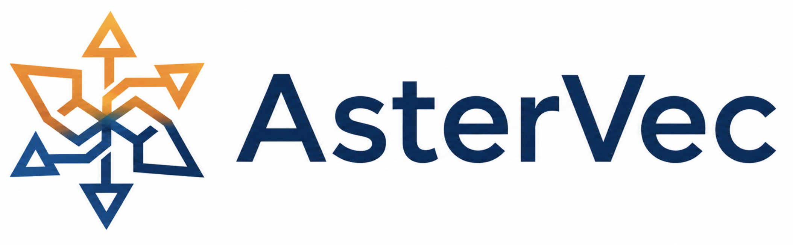

<p align="center">
  
</p>

<p align="center">
  <b><span style="font-size: 1.15em;">Memory-friendly vector engine for on-device AI memory.</span></b>
</p>

<p align="center">
  <a href="#quick-start">Quick Start</a> ·
  <a href="#install--build">Install / Build</a> ·
  <a href="docs/API_REFERENCE.md">Python / C++ API</a> ·
  <a href="docs/HTTP_API.md">HTTP API</a>
</p>

AsterVec lets AI applications run persistent vector search with much less system
memory. It stores vectors and the largest graph layer on disk with
**[Aster](https://github.com/NTU-Siqiang-Group/Aster)**, a graph-oriented LSM-tree
storage engine, while keeping only the hot navigation path in RAM. This makes
retrieval practical on personal computers for AI agents and desktop RAG, while
extending naturally to large-scale deployments.

Use AsterVec as a local vector retrieval layer in two modes:

- **Embed it** *(primary)* — run the engine in-process for agent retrieval,
  RAG embeddings, and app-owned vector storage.
- **Serve it** *(optional)* — run `astervec_http` when an app needs a local REST
  boundary.

## Why AsterVec?

- **Minimal memory footprint.** Unlike vector databases that hold the whole index
  in RAM, AsterVec is disk-oriented — memory stays small and predictable at scale.
- **Built for on-device retrieval.** Disk-backed indexes keep persistent retrieval
  practical for agents, desktop RAG, and small servers.
- **Graph-in-LSM storage.** AsterVec persists the largest HNSW layer in Aster
  `RocksGraph`, keeping only the upper navigation layers in memory.
- **Designed as an engine.** Embed it into your app when retrieval state should stay
  local, private, and application-owned.

## Features

- **Local retrieval engine** — embed persistent vector search directly in Python or
  C++ applications.
- **Thread-safe embedded API** — run search and incremental writes from application
  worker threads.
- **Agent/RAG-ready metadata** — attach JSON payloads and filter retrieval with
  Mongo-style predicates (`$eq`, `$gt`, `$in`, `$and`, ...).
- **Mutable vector lifecycle** — upsert vectors, update payloads, and delete ids
  without rebuilding the index.
- **Disk-backed HNSW** — layer-0 edges live in Aster `RocksGraph`; upper layers stay
  in memory.
- **Graph-aware vector layout** — AsterVec places graph-near vectors into shared
  4 KB pages, then uses page caching and SQ8 compression to keep reads compact.
- **Fast initial loads** — build an empty index in memory when embeddings fit in
  RAM; use streaming insert/update for incremental changes.
- **Optional service mode** — expose the same engine through `astervec_http` when a
  REST boundary is useful.

## Quick Start

AsterVec is embedded directly in your application. (Prefer a network service? See
[Run as an HTTP service](#run-as-an-http-service-optional).)

### Python (`import astervec`)

```bash
git submodule update --init --recursive
make aster
python -m pip install .          # builds + installs the astervec module
```

```python
import astervec

opts = astervec.AsterVecDBOptions()
opts.dim = 128
opts.vector_file_path = "./db/vectors.bin"
opts.reinit = True               # start fresh

db = astervec.AsterVecDB.open("./db", opts)

db.insert(1, [0.1] * 128, metadata={"source": "notes", "type": "snippet"})

# k-NN search → list[SearchResult(id, distance)]
for r in db.search_knn([0.1] * 128, k=10, ef_search=128):
    print(r.id, r.distance)

# filtered search → list[dict] of {"id", "distance"}
hits = db.search([0.1] * 128, k=10, filter={"source": "notes"})

db.close()
```

Both Python lists and NumPy `float32` arrays are accepted. See the
[Python / C++ API reference](docs/API_REFERENCE.md) and the
[Python SDK guide](docs/python_sdk_guide.md).

For initial loads, use `bulk_build` when the full embedding set fits in memory;
use `insert` / `update` for incremental changes.

```python
vectors = np.random.rand(100_000, 128).astype("float32")
report = db.bulk_build(vectors, threads=4)
```

### C++

Include headers from `include/` and link `libastervec.a` (static) or
`libastervec.so`/`.dylib`. Transitive deps: `rocksdb` (Aster), `zstd`, `pthread`,
`dl` (plus `jemalloc` on macOS).

```cpp
#include "astervec_db.h"
using namespace astervec;

AsterVecDBOptions opts;
opts.dim = 128;
opts.vector_file_path = "./db/vectors.bin";
opts.reinit = true;

std::unique_ptr<AsterVecDB> db;
AsterVecDB::Open("./db", opts, &db);

std::vector<float> v(128, 0.1f);
db->Insert(1, v);

SearchOptions so; so.k = 10; so.ef_search = 128;
std::vector<SearchResult> results;
db->SearchKnn(v, so, &results);

db->Close();
```

## How it works

```
AsterVecDB (public API — astervec_db.h)
  └─ AsterVec (HNSW index)
       ├─ RocksGraph (Aster)  — layer-0 graph edges on disk (LSM-tree)
       ├─ nodes_ map          — upper-layer edges in memory
       └─ IVectorStorage      — vectors on disk (graph-aware pages + cache + SQ8)
```

AsterVec keeps the hot navigation path small. Upper HNSW layers stay in memory,
while layer-0 edges and vector data are stored on disk. Instead of laying vectors
out by id, the vector store uses the HNSW search path to choose a section for each
vector, so vectors likely to be visited together are co-located in 4 KB pages. A
small page cache and SQ8 compression keep search practical under tight memory
budgets.

## Install / Build

The Quick Start above is the normal path for using AsterVec from Python or C++.
This section is for local development, contributors, and source builds.

### Prerequisites

- C++17 compiler (GCC 8+ / Clang 10+), CMake ≥ 3.10, GNU Make, Boost (headers only)
- **zstd** — the only required compression library (Aster is built with snappy /
  lz4 / bzip / zlib disabled)
- jemalloc on macOS

**Ubuntu / Debian**

```bash
sudo apt-get install -y build-essential cmake libboost-dev libzstd-dev
```

**macOS (Homebrew)**

```bash
brew install cmake boost zstd jemalloc
```

### Build

```bash
git submodule update --init --recursive
make aster
make
python -m pip install .
```

`make` produces the static/shared libraries and the `astervec` test/benchmark binary.
To build the optional HTTP server, see
[Run as an HTTP service](#run-as-an-http-service-optional). `python -m pip install .`
compiles the bindings via scikit-build-core (no separate `make lib` needed).

## Run as an HTTP service (optional)

`astervec_http` exposes the same local engine over REST. Use it when an agent,
desktop app, or local service needs a process boundary instead of embedding directly.
It does **not** authenticate requests itself; run it behind your own reverse proxy if
you need TLS or an API key.

```bash
# Build the server target (configured by default after `make`):
cmake --build build --target astervec_http -j
ASTERVEC_DATA_DIR=./data ./build/bin/astervec_http        # serves on :8000

# Or with Docker:
docker build -t astervec:latest .                        # needs lib/aster populated first
docker run -d --name astervec -p 8000:8000 -v "$(pwd)/data:/data" astervec:latest
```

See the full **[HTTP API reference](docs/HTTP_API.md)** for endpoint examples,
metadata filters, and service configuration.

## Configuration

Pass an `AsterVecDBOptions` to `open`. Common fields:

| Field | Default | Description |
|-------|---------|-------------|
| `dim` | `0` | **Required.** Vector dimensionality. |
| `metric` | `L2` | `L2` or `Cosine`. |
| `m` | `8` | HNSW links per node (layer 0). |
| `m_max` | `24` | HNSW max neighbors, upper layers. |
| `ef_construction` | `32.0` | Candidate pool during construction. |
| `ef_search` | `128` | Default candidate pool during search. |
| `paged_max_cached_pages` | `8192` | Page cache size (4 KB pages). |
| `reinit` | `false` | `true` = wipe on open; `false` = reopen. |
| `vector_file_path` | `""` | Path to the vector data file. |

Higher `m` / `ef_construction` → better recall, slower build. Higher `ef_search` →
better recall, slower queries. See [API_REFERENCE.md](docs/API_REFERENCE.md) for
the complete list.

For service mode, use `ASTERVEC_*` environment variables; see
[HTTP_API.md](docs/HTTP_API.md).

## Test binary / benchmarking

`make` also builds `build/bin/astervec`, a CLI harness that loads a dataset, builds
the index, runs k-NN queries, and compares against ground truth — useful for
benchmarking (not the way you'd use the engine in an app).

```bash
cd data && python prepare_sift_100k.py && cd ..
./build/bin/astervec --db ./run/db --data-dir ./data/sift_100k_ \
  --M 8 --Mmax 24 --efc 32 --k 10 --efs 128 --stats --out ./run/output.txt
```

Run `./build/bin/astervec --help` for all flags (HNSW params, storage backend,
batch read, etc.).

## Troubleshooting

- **`Aster RocksDB library or headers not found`** — build Aster first:
  `git submodule update --init --recursive && make aster`.
- **`libzstd not found`** — install zstd (the only required codec):
  `apt-get install libzstd-dev` / `brew install zstd`.
- **`FetchContent` can't download pybind11 during `pip install .`** — install
  pybind11 (`pip install pybind11` or conda) and switch the `FetchContent` block in
  `CMakeLists.txt` to `find_package(pybind11 REQUIRED)`.
- **`externally-managed-environment` on `pip install .`** — use a virtualenv/conda
  environment.
- **`cannot allocate memory in static TLS block` (Linux, jemalloc)** — preload
  jemalloc: `LD_PRELOAD=/lib/x86_64-linux-gnu/libjemalloc.so.2 python your_app.py`.
- **`libastervec.so: cannot open shared object file`** — add the build dir to the
  loader path: `export LD_LIBRARY_PATH=$PWD/build/lib:$LD_LIBRARY_PATH`.

## Contributing

Contributions are welcome. See [CONTRIBUTING.md](CONTRIBUTING.md) for source
builds, tests, PR expectations, and issue reports.

## License

Apache-2.0 — see [LICENSE](LICENSE).
